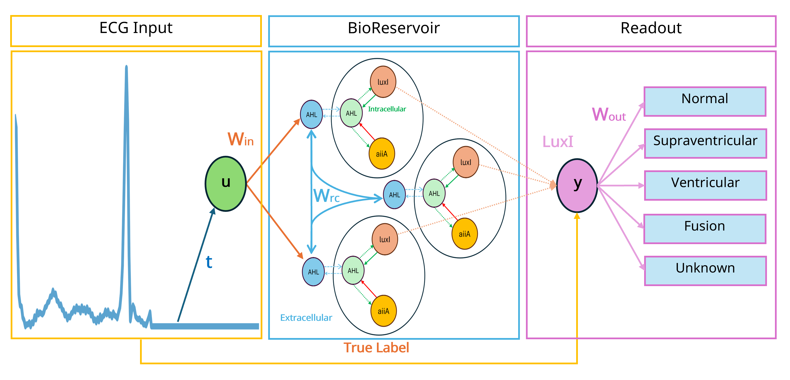
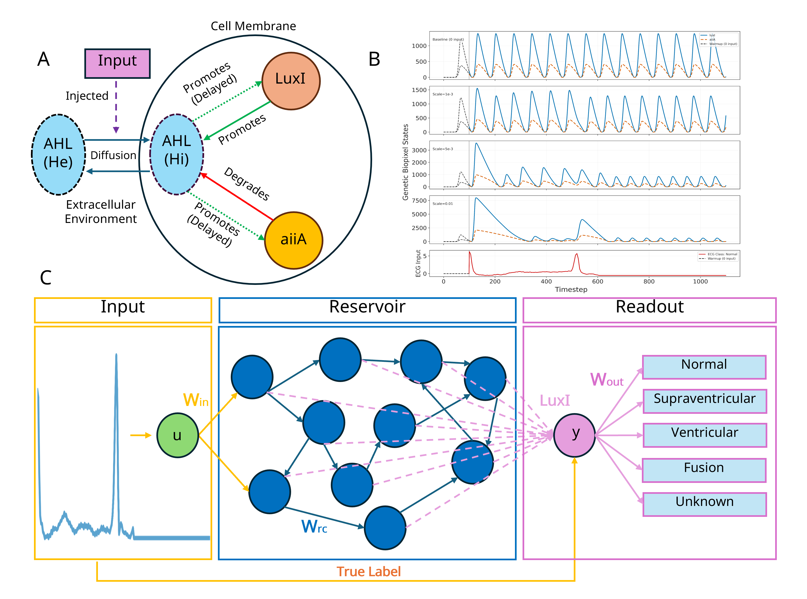
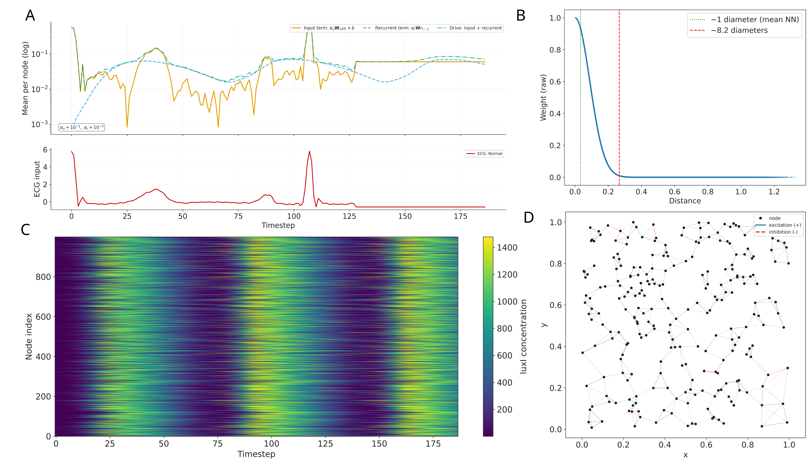
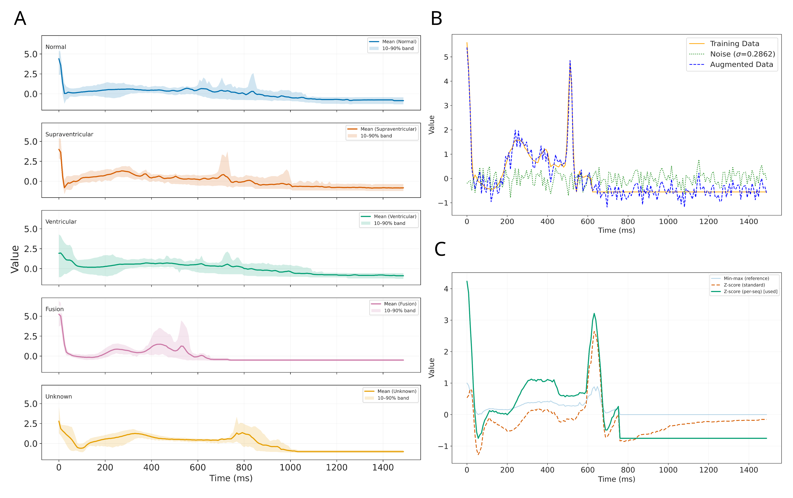
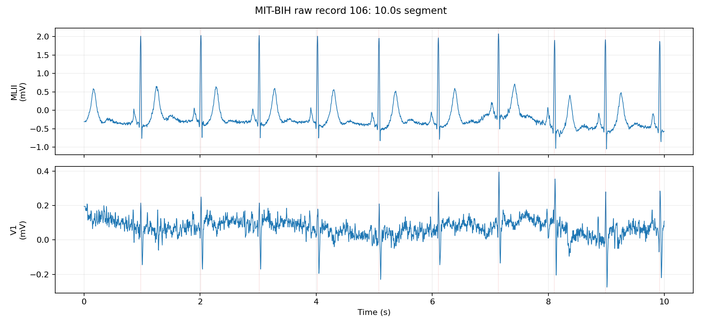
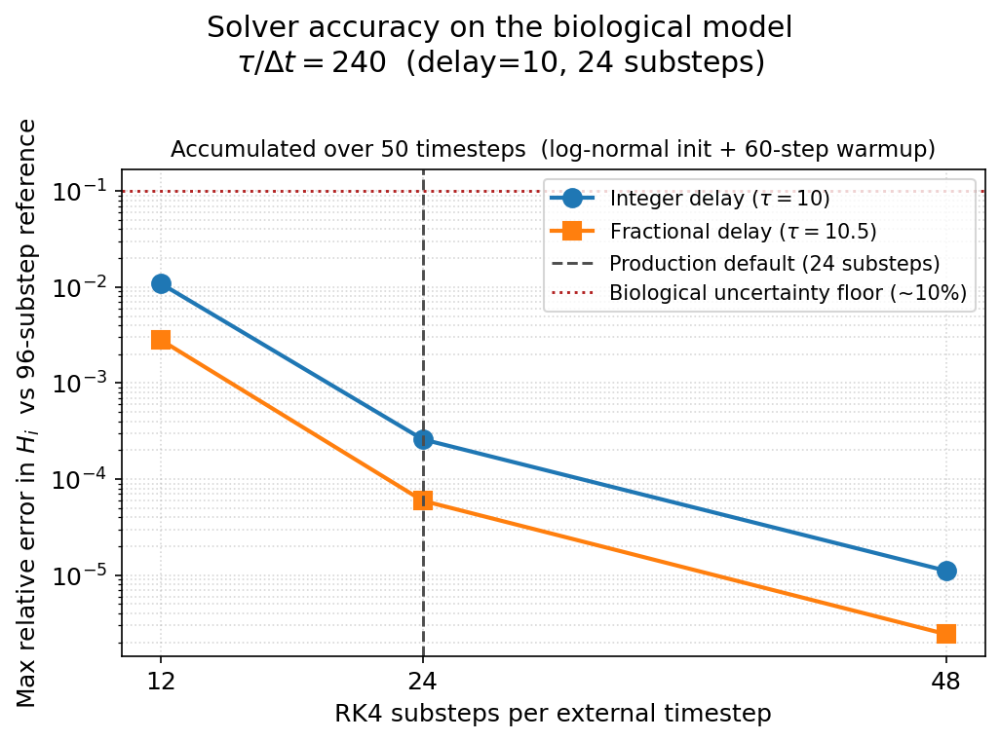
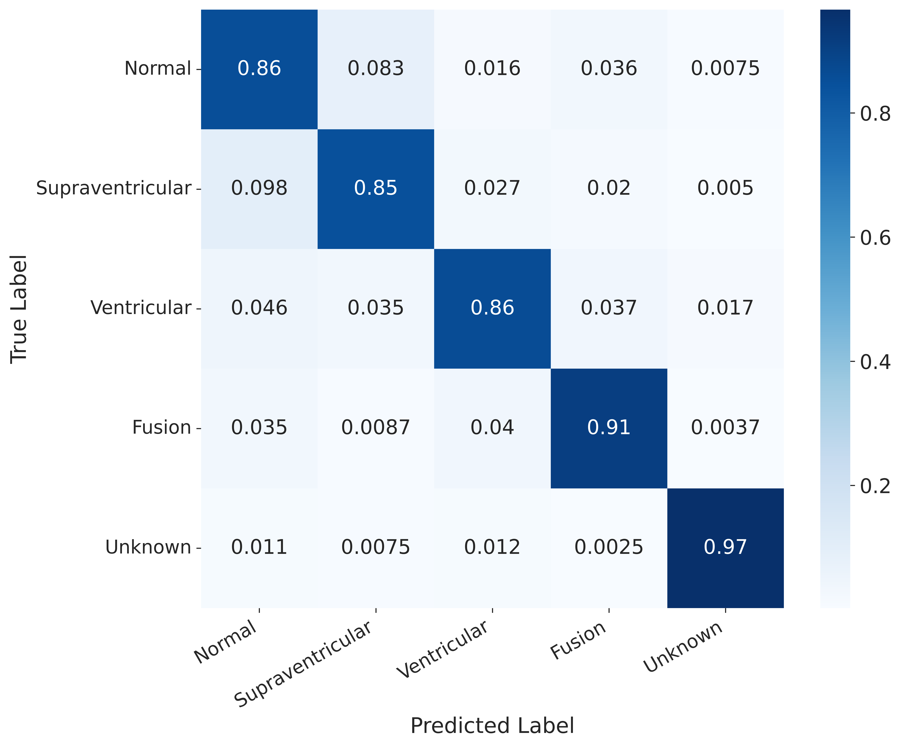
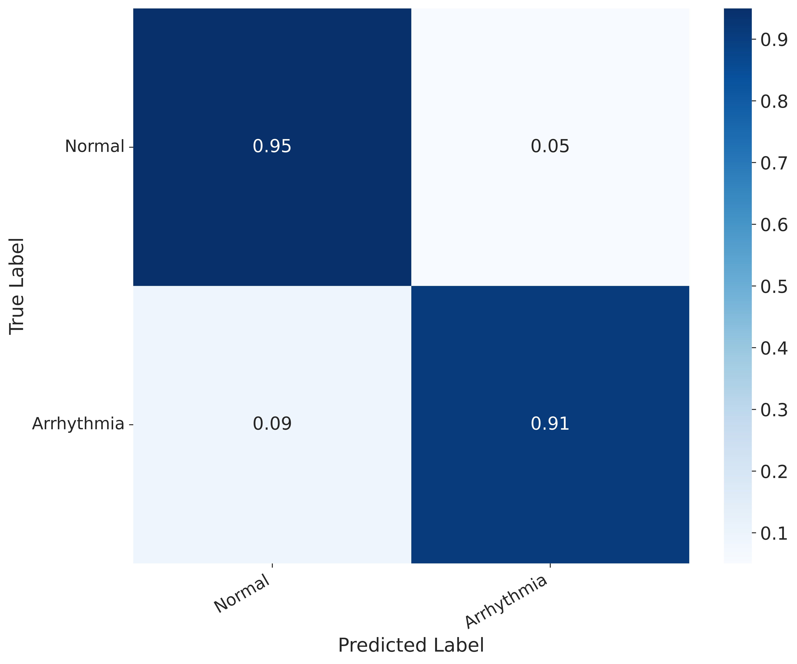
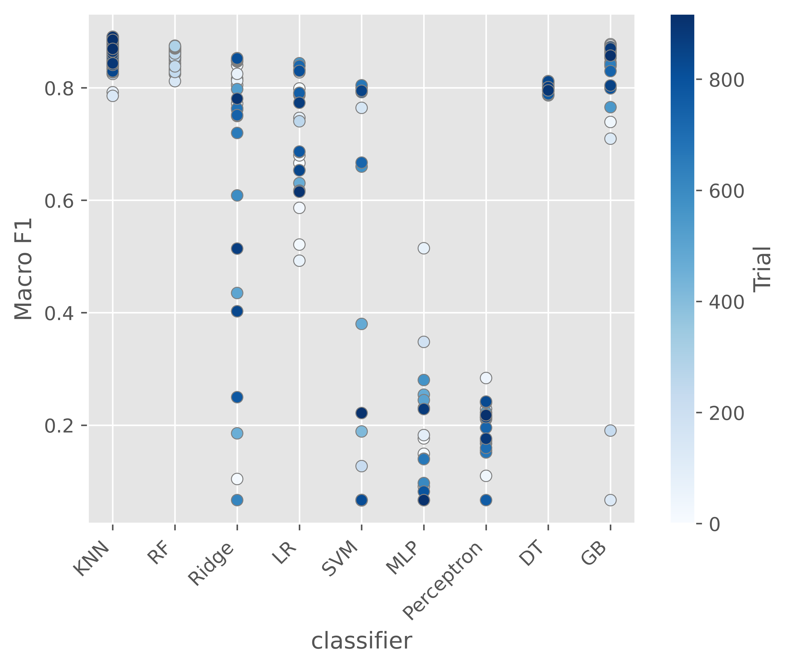

# Reservoir Computing with Genetic Oscillators

A reservoir computing framework built on coupled genetic oscillators for ECG arrhythmia classification. Each reservoir node is a quorum-sensing oscillator modelled by delay differential equations (DDEs), implemented as a [ReservoirPy](https://github.com/reservoirpy/reservoirpy) `Node`.

> For a comprehensive overview, see our associated research paper.

## Project Overview



High-level overview of the biological reservoir computing pipeline: ECG sequences perturb quorum-sensing genetic oscillators, the coupled reservoir transforms those inputs into a high-dimensional dynamical state, and a lightweight readout performs the final classification.

## Environment Setup

```bash
python -m venv venv
source venv/bin/activate
pip install -e .[dev]
```

## Example Usage

```python
from bioreservoir import BioReservoir, distance_matrix
from utils.preprocessing import load_ecg_data
from training import cross_validate
from utils.analysis import compute_mean_metrics

# Load arrhythmia ECG data (balanced 5-class)
X_train, Y_train, X_test, Y_test = load_ecg_data(rows=1000)

# Initialise reservoir and readout
import reservoirpy as rpy
from reservoirpy.nodes import Ridge

reservoir = BioReservoir(units=100)
readout = Ridge(ridge=1e-6)

# Combine train+test for cross-validation
import numpy as np
X = np.concatenate([X_train, X_test])
Y = np.concatenate([Y_train, Y_test])

# 5-fold cross-validation
results = cross_validate(reservoir, readout, X, Y, folds=5)
```

## Project Structure

- **bioreservoir/** — Core library: DDE solver, `BioReservoir` node, topology generation (distance-based spatial kernels).
- **training/** — Cross-validation pipeline, classification helpers, profiling utilities.
- **optimization/** — Optuna hyperparameter studies, study registry, and CLI commands for running/evaluating studies.
- **utils/** — Preprocessing (ECG loading, augmentation, scaling), analysis metrics, visualisation, and result management.
- **scripts/** — Standalone experiment scripts and analysis helpers.
- **data/ecg/** — MIT-BIH arrhythmia dataset files.
- **results/** — Stored outputs: fold runs, metrics, optimisation studies, reservoir states.

## How It Works

1. **Genetic oscillator nodes** — Each node simulates two coupled genes (luxI and aiiA) that produce an intracellular AHL signal (Hi) which diffuses externally (He). The system is driven by a system of DDEs with delayed negative feedback.

2. **External input** — ECG time-series samples are fed through He, representing the influence of the extracellular environment on the oscillator dynamics.

3. **Reservoir network** — A spatial topology of oscillator nodes is constructed with distance-dependent coupling weights (Gaussian or exponential decay kernels).

4. **State extraction** — At each timestep the concentration of each node's luxI gene is read out, producing a high-dimensional state representation of the input.

5. **Classification** — A readout layer (Ridge, KNN, or Random Forest) is trained on the final reservoir states to classify the input into arrhythmia categories.

## Visualisation

### Biopixel Reservoir Model


**(a)** Schematic of a quorum-sensing genetic oscillator (biopixel) comprising luxI, aiiA, intracellular AHL (Hi), and extracellular AHL (He). **(b)** Effective input scales showing how external ECG drive and recurrent coupling modulate gene expression dynamics. **(c)** Reservoir computing architecture: ECG time-series inputs are fed through a network of coupled oscillator nodes, and the final luxI concentrations are read out for classification.

### Reservoir Dynamics and Topology


Characterisation of reservoir dynamics and spatial topology. Panels show the relative magnitude of input and recurrent drive contributions, reservoir state heatmaps over time, distance-based spatial weight kernels, and topology connectivity structure.

### ECG Dataset and Preprocessing


**(a)** Class-averaged ECG waveforms for each heartbeat category with 10–90% percentile bands showing intra-class variability. **(b)** Additive Gaussian noise augmentation applied to a single ECG instance. **(c)** Effect of different preprocessing scalers on the input waveform shape.

### Raw MIT-BIH ECG Segment


Example raw ECG segment from the source MIT-BIH record exploration workflow, showing the morphology and annotation context before conversion into single-beat classification instances.

### DDE Solver Validation


Convergence analysis of the RK4 DDE solver, validating numerical accuracy across step sizes.

### Classification Results (Balanced 5-Class)


Aggregated confusion matrix across five folds for the balanced five-class arrhythmia task (N=1000, KNN k=4, distance-weighted). Off-diagonal values indicate common misclassification patterns.

### Classification Results (Binary)


Aggregated confusion matrix across five folds for the binary Normal vs Arrhythmia task (N=1000, Random Forest).

### Hyperparameter Optimisation


Updated Optuna slice plot generated from the training study evaluation command for the Phase 2 joint optimisation (r1a-refined, distance-based topology). Each panel shows per-trial macro F1-score as a function of one hyperparameter.

### Readout Optimisation


Optuna slice plot generated from the balanced readout optimisation study (ro1-readout), showing how classifier-specific hyperparameters affect macro F1 across the frozen-state readout search.

## Optimisation CLI

Use the unified optimisation CLI to run studies, inspect the best trials, and regenerate diagnostic plots. See `python -m optimization.optimize --help` for the full option set.

### Run Studies

```bash
python -m optimization.optimize research --type training --study r1a-refined --processes 32
python -m optimization.optimize research --type readout --study ro1-readout --trial_name r1a-refined-best --processes 32
```

### Evaluate Studies

```bash
python -m optimization.optimize evaluate --type readout --study ro1-readout --plots slice --show metrics
python -m optimization.optimize evaluate --type training --study r1a-refined --plots slice --show metrics
```

Both commands generate plots into `results/optimization/`.

### Host-Agnostic Reproducibility Scripts

Some studies are intentionally script-driven rather than Optuna-driven. These remain reproducible because they are self-contained Python entrypoints with no host-specific orchestration:

- [scripts/run_ablation.py](scripts/run_ablation.py) — Ablation conditions with fixed reservoir and RF readout.
- [scripts/run_heterogeneity.py](scripts/run_heterogeneity.py) — Parameter heterogeneity robustness grid.

Run these locally in the same Python environment as the optimisation CLI.

> [!TIP]
> Use `--help` to see what else is available

Example output from the readout evaluation:

```text
========================================================================
	ALL classifiers — ro1-readout
========================================================================
		f1  trial classifier  knn_n_neighbors  knn_p knn_weights  accuracy     f1   f1_std  n_folds  precision  recall  runtime
0.8907    542        KNN                4  1.037    distance    0.8899 0.8907 0.006768        5     0.8941  0.8899    792.6

	Summary — top   10: mean=0.8907  std=0.0001  min=0.8904  max=0.8907
	Summary — all   914: mean=0.7982  std=0.2079  min=0.0662  max=0.8907
```

Example output from the training evaluation:

```text
========================================================================
	study — r1a-refined
========================================================================
		f1  trial  cell_coupling  dde_scaling  fade_alpha  input_connectivity  input_scaling  p_excite  rc_scaling  sparsity  units  warmup  accuracy     f1  precision  recall  runtime
0.9047    416          12.75    0.0006439   2.803e-05              0.5282         0.0277    0.8354    0.007036     0.576   1000      50    0.9041 0.9047     0.9096  0.9041     2401

	Summary — top   10: mean=0.9014  std=0.0019  min=0.8988  max=0.9047
	Summary — all   768: mean=0.8481  std=0.0748  min=0.1924  max=0.9047
```

## Acknowledgements

**ReservoirPy** — Our `BioReservoir` class extends the ReservoirPy `Node` class.
- [reservoirpy](https://github.com/reservoirpy/reservoirpy)

**Optuna** — Hyperparameter optimisation framework used for study-based tuning.
- [Optuna](https://github.com/optuna/optuna)

**Genetic Oscillators** — Our approach builds upon research into coupled genetic oscillators within bacterial colonies:
- [A sensing array of radically coupled genetic 'biopixels'](https://doi.org/10.1038/nature10722) — Prindle et al. (2011)
- [A synchronized quorum of genetic clocks](https://doi.org/10.1038/nature08753) — Danino et al. (2010)

**Arrhythmia Dataset** — MIT-BIH dataset from Kaggle:
- [Kaggle Heartbeat Dataset](https://www.kaggle.com/datasets/shayanfazeli/heartbeat) — Shayan Fazeli
- [ECG Heartbeat Classification: A Deep Transferable Representation](http://dx.doi.org/10.1109/ICHI.2018.00092) — Kachuee et al. (2018)
